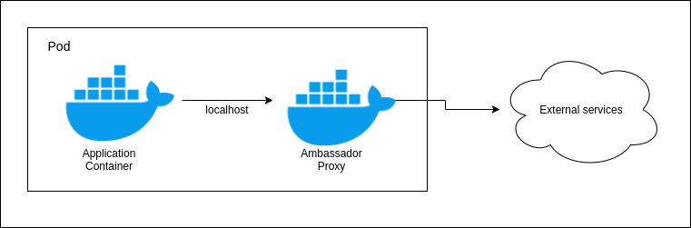

# The Ambassador Pattern

Just like the **Sidecar** pattern, the Ambassador is a container that runs in the same Pod that the application container runs.

Basically, the Ambassador works as a proxy, it handles all the requests coming from the application.

One of the main advantages of this pattern is that there is no need that the application container knows the external services URLs, he will always communicate through `localhost` with the Ambassador.

The Ambassador is responsible to `discover` the external service address (this process is also knows as `Service Discovery`).

---

## Example

### Sharded Redis

- We have a `StatefulSet` defining 3 replicas of a `redis` container;
- Also, there is a `Service` called `redis-svc` to expose the containers to the cluster;
- We're using [twemproxy](https://github.com/twitter/twemproxy) to act as a proxy to the redis containers;
- Lastly, we defined a `Pod` called `ambassador-example`. It defines two containers:
  - `nginx`: our client application that needs to communicate with the `redis`
  - `twemproxy`: who will send the request to one of the redis containers.

As you may see in the above image. All the requests coming from the application are send through localhost to the Ambassador (`twemproxy`).
